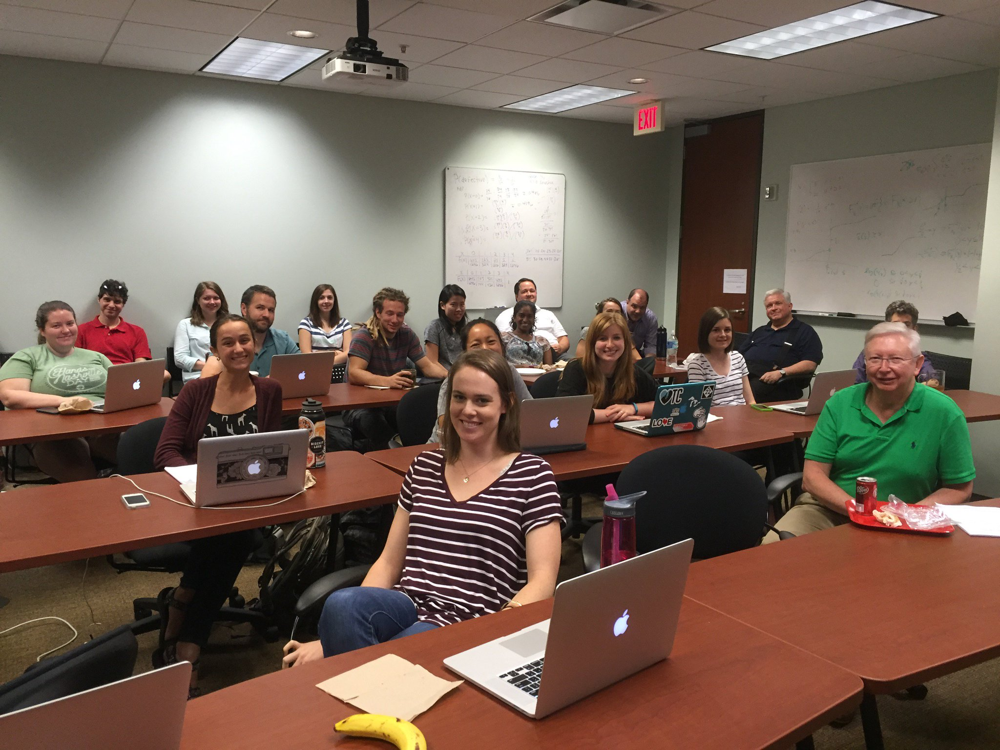

The Biostatistics Graduate Student Association was founded in 2016 by a group of enthusiastic students who were particularly excited about getting food at journal club, nerdy t-shirts, and sharing knowledge. It is a recognized organization of Vanderbilt University as well as an ASA student chapter. Currently, it functions primarily to host bi-monthly student-run Journal Clubs. 

*Mission*:
We seek to facilitate an environment for students to engage in discussions regarding biostatistics and data science concepts in order to further their knowledge and understanding of the current state of the field.

***

## Select Past Meetings

* Mark led a discussion on the article "Fair Treatment Comparisons in Observational Research".
* Nate led a discussion about "On the Variances of Asymptotically Normal Estimators from Complex Surveys”.
* Sandya led a discussion on "A Statistical Framework for the Adaptive Management of Epidemiological Interventions”.
* Sarah led a discussion on the paper "Bias and efficiency of multiple imputation compared with complete-case analysis for missing covariate values.”
* Allison led a discussion on the article "When Efficient Model Averaging Out-Performs Boosting and Bagging.”