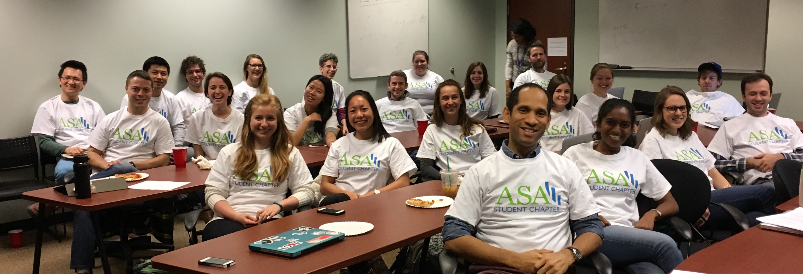

The Biostatistics Graduate Student Association was founded in 2016 by a group of enthusiastic students who were particularly excited about getting food at journal club, nerdy t-shirts, and sharing knowledge. It is a recognized organization of Vanderbilt University as well as an ASA student chapter. Currently, it functions primarily to host bi-monthly student-run Journal Clubs. 

*Mission*:
We seek to facilitate an environment for students to engage in discussions regarding biostatistics and data science concepts in order to further their knowledge and understanding of the current state of the field.

  

***
## Special Event - The Effort Report: Live at Vanderbilt `r emo::ji("studio_microphone")`  

[The Effort Report](http://theeffortreport.com/about/), hosted by Dr. Roger Peng from Johns Hopkins University and Dr. Elizabeth Matsui from University of Texas at Austin, recorded their podcast live at Vanderbilt on January 25 2019. The episode was focused on the challenges of professional life and academia, with advice for current students. You can listen to the episode [here](http://effortreport.libsyn.com/87-live-from-vanderbilt-university).

***

## Journal Club 

### Dates 

`r emo::ji("calendar")` 08/28/2019 - `r emo::ji("party_popper")` Welcome Back Social `r emo::ji("party_popper")`    
`r emo::ji("calendar")` 09/11/2019 - Elizabeth Sigworth, *TBD*  

### Journal Club expectations

* All are welcome to attend, however the content is set specifically for 3rd year+.  
* All attendees are expected to have read the article. Here is a good intro on [How to Read the Statistical Methods Literature](https://www.tandfonline.com/doi/abs/10.1080/00031305.1997.10473951). 
* The leader for the week will lead a general discussion, occasionally accompanied by a short presentation of the material. 
* Students in 3rd year+ are required to present once per year (after completing your orals).  
* You can [sign up for a slot here](https://docs.google.com/spreadsheets/d/1opQ0A6lmqJsiyoxK5oCk_kXHEhhR4cUvR7iMBpsmWcc/edit#gid=0). _If you haven't signed up by September 1st, you will be randomly assigned._
* Please send your Journal article to the Secretary no less than 2 weeks in advance to allow for time to disseminate to all students.  
* Presenters are required to invite at least one faculty member to attend their meeting and participate in the discussion.
